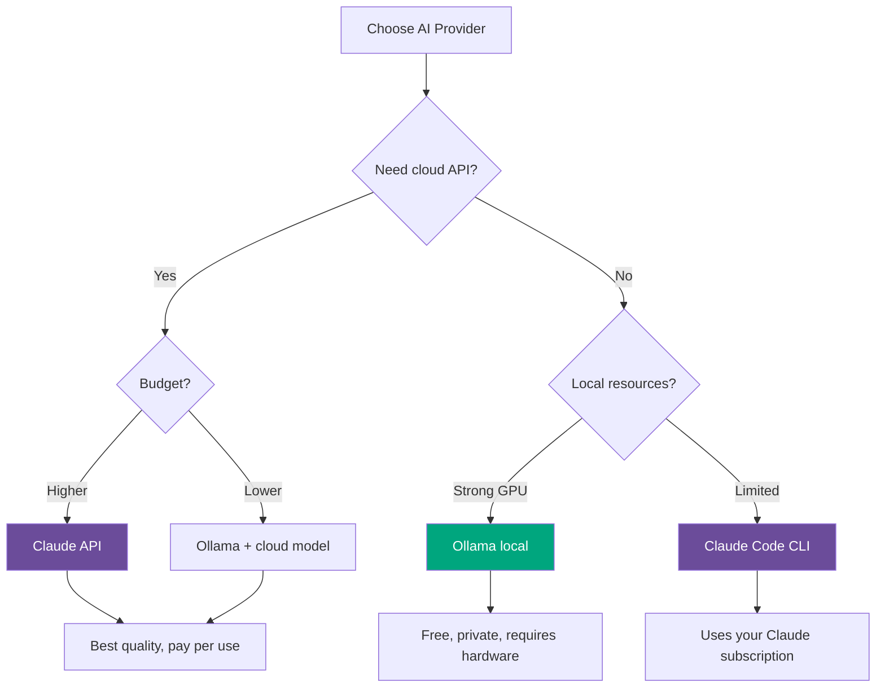
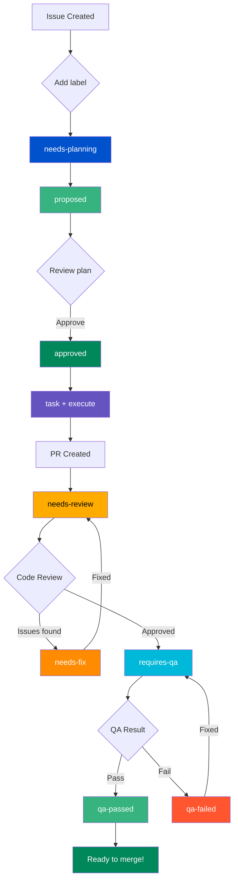

# Setting Up repo-sapiens with a New Gitea Repository

A complete, step-by-step tutorial for configuring repo-sapiens automation on a fresh Gitea repository.

---

## Prerequisites

Before you begin, ensure you have:

- [ ] Access to a Gitea instance with **Actions enabled**
- [ ] A Gitea account with permission to create repositories
- [ ] Python 3.11 or higher installed locally
- [ ] Git installed and configured
- [ ] **One of the following AI providers:**
  - **Claude API** - Anthropic API key (https://console.anthropic.com/)
  - **Claude Code** - Claude Code CLI installed locally
  - **Ollama** - Ollama running locally or on a server (https://ollama.ai/)

---

## Part 1: Create Your Gitea Repository

### Step 1.1: Create the Repository

1. Navigate to your Gitea instance (e.g., `https://gitea.example.com`)
2. Click the **+** button → **New Repository**
3. Fill in the details:
   - **Owner**: Your username or organization
   - **Repository Name**: e.g., `my-project`
   - **Visibility**: Private or Public (your choice)
   - **Initialize repository**: Check this box
   - **Default Branch**: `main`
4. Click **Create Repository**

### Step 1.2: Clone the Repository Locally

```bash
# Clone your new repository
git clone https://gitea.example.com/your-username/my-project.git
cd my-project
```

### Step 1.3: Create a Gitea API Token

1. In Gitea, click your profile picture → **Settings**
2. Go to **Applications** → **Manage Access Tokens**
3. Click **Generate New Token**
4. Configure the token:
   - **Token Name**: `repo-sapiens-automation`
   - **Scopes**: Select at minimum:
     - `repo` (Full control of repositories)
     - `issue` (Read/write issues)
     - `notification` (optional, for notifications)
5. Click **Generate Token**
6. **Copy and save the token immediately** - you won't see it again!

---

## Part 2: Choose Your AI Provider

repo-sapiens supports multiple AI providers. Choose the one that best fits your needs:



### Option A: Claude API (Recommended for Production)

**Best for:** Teams, CI/CD pipelines, production workloads

**Pros:**
- Highest quality results (Claude Opus 4.5, Sonnet 4.5)
- No local resources required
- Works in CI/CD environments
- Consistent performance

**Cons:**
- Costs money per API call
- Requires internet connection
- Data sent to Anthropic's servers

**Requirements:**
- Anthropic API key from https://console.anthropic.com/
- API credits

### Option B: Claude Code (Local CLI)

**Best for:** Individual developers with Claude subscription

**Pros:**
- Uses your existing Claude subscription
- Rich interactive experience
- Can access local files directly

**Cons:**
- Requires Claude Code CLI installed
- Not suitable for CI/CD (interactive)
- Tied to your personal account

**Requirements:**
- Claude Code CLI: `npm install -g @anthropic-ai/claude-code`
- Active Claude subscription

### Option C: Ollama (Self-Hosted)

**Best for:** Privacy-conscious teams, air-gapped environments, cost optimization

**Pros:**
- Completely free (after hardware)
- Data never leaves your infrastructure
- Works offline
- No API costs

**Cons:**
- Requires capable hardware (GPU recommended)
- Quality varies by model
- Setup and maintenance overhead

**Requirements:**
- Ollama installed: https://ollama.ai/download
- A pulled model: `ollama pull llama3.1:8b` or `ollama pull codellama`
- Sufficient RAM (8GB+ for small models, 16GB+ for larger)

### Quick Comparison

| Feature | Claude API | Claude Code | Ollama |
|---------|------------|-------------|--------|
| Cost | Pay per use | Subscription | Free |
| Quality | Excellent | Excellent | Good to Very Good |
| Privacy | Cloud | Cloud | Local |
| CI/CD Ready | ✅ | ❌ | ✅ |
| Offline | ❌ | ❌ | ✅ |
| Setup | Easy | Easy | Moderate |

---

## Part 3: Install and Initialize repo-sapiens

### Step 3.1: Install repo-sapiens

```bash
# Option A: Install from PyPI (recommended)
uv tool install repo-sapiens

# Option B: Install from source (for development)
git clone https://github.com/savorywatt/repo-sapiens.git
cd repo-sapiens
uv sync --group dev
```

Verify the installation:

```bash
sapiens --help
# Or if installed from source:
uv run sapiens --help
```

### Step 3.2: Initialize in Your Repository

Navigate to your cloned repository and run the interactive setup:

```bash
cd /path/to/my-project
sapiens init
```

The init wizard will:

1. **Auto-detect** your Git remote configuration
2. **Prompt** for your Gitea API token
3. **Ask** which AI provider you want to use
4. **Collect** provider-specific credentials
5. **Store** credentials securely
6. **Generate** `.sapiens/config.yaml`

#### Example: Claude API Setup

```
🚀 Initializing repo-sapiens

🔍 Discovering repository configuration...
   ✓ Found Git repository: /home/user/my-project
   ✓ Detected remote: origin
   ✓ Parsed: owner=your-username, repo=my-project
   ✓ Base URL: https://gitea.example.com

🔑 Setting up credentials...

Gitea API Token is required. Get it from:
   https://gitea.example.com/user/settings/applications

Enter your Gitea API token: ●●●●●●●●●●●●

Select AI provider:
  1. Claude API (cloud)
  2. Claude Code (local CLI)
  3. Ollama (self-hosted)

Enter choice [1]: 1

Enter your Claude API key: ●●●●●●●●●●●●

📦 Storing credentials in keyring backend...
   ✓ Stored: gitea/api_token
   ✓ Stored: claude/api_key
   ✓ Credentials stored securely

📝 Creating configuration file...
   ✓ Created: .sapiens/config.yaml

✅ Initialization complete!
```

#### Example: Ollama Setup

```
🚀 Initializing repo-sapiens

🔍 Discovering repository configuration...
   ✓ Found Git repository: /home/user/my-project
   ✓ Detected remote: origin
   ✓ Parsed: owner=your-username, repo=my-project
   ✓ Base URL: https://gitea.example.com

🔑 Setting up credentials...

Gitea API Token is required. Get it from:
   https://gitea.example.com/user/settings/applications

Enter your Gitea API token: ●●●●●●●●●●●●

Select AI provider:
  1. Claude API (cloud)
  2. Claude Code (local CLI)
  3. Ollama (self-hosted)

Enter choice [1]: 3

Enter Ollama base URL [http://localhost:11434]: http://localhost:11434
Enter model name [qwen3:latest]: qwen3:latest

📦 Storing credentials in keyring backend...
   ✓ Stored: gitea/api_token
   ✓ Ollama configured (no API key needed)

📝 Creating configuration file...
   ✓ Created: .sapiens/config.yaml

✅ Initialization complete!

💡 Make sure Ollama is running: ollama serve
💡 Pull your model if needed: ollama pull qwen3:latest
```

#### Setting Up Ollama Before Init

If you chose Ollama, ensure it's properly configured:

```bash
# Install Ollama (macOS/Linux)
curl -fsSL https://ollama.ai/install.sh | sh

# Start Ollama server
ollama serve

# In another terminal, pull a model
ollama pull qwen3:latest       # Recommended for code tasks
ollama pull llama3.1:8b        # General purpose, good balance
ollama pull deepseek-coder:6.7b  # Fast code completion

# Verify it's working
curl http://localhost:11434/api/tags
```

**Recommended Ollama Models for Code:**

| Model | Size | RAM Needed | Best For |
|-------|------|------------|----------|
| `codellama:7b` | 4GB | 8GB | Fast, basic tasks |
| `qwen3:latest` | 5GB | 10GB | Best balance (recommended) |
| `llama3.1:8b` | 5GB | 10GB | General + code |
| `deepseek-coder:6.7b` | 4GB | 8GB | Code-focused |
| `codellama:34b` | 19GB | 32GB | Best quality |

---

## Part 4: Set Up Gitea Repository Secrets

The Gitea Actions workflows need access to your credentials. These must be configured as repository secrets.

### Step 4.1: Navigate to Repository Secrets

1. Go to your repository in Gitea
2. Click **Settings** (gear icon)
3. Click **Actions** → **Secrets**

### Step 4.2: Add Required Secrets

The secrets you need depend on your chosen AI provider:

#### Core Secrets (Always Required)

| Secret Name | Value | Description |
|-------------|-------|-------------|
| `SAPIENS_GITEA_TOKEN` | Your Gitea API token | Used to interact with issues, PRs, and labels |
| `SAPIENS_GITEA_URL` | `https://gitea.example.com` | Your Gitea instance URL |

#### If Using Claude API

| Secret Name | Value | Description |
|-------------|-------|-------------|
| `SAPIENS_CLAUDE_API_KEY` | Your Claude API key | From https://console.anthropic.com/ |

#### If Using Ollama

| Secret Name | Value | Description |
|-------------|-------|-------------|
| `SAPIENS_OLLAMA_BASE_URL` | `http://ollama-server:11434` | Ollama API endpoint |
| `SAPIENS_OLLAMA_MODEL` | `qwen3:latest` | Model to use |

> **Note:** If Ollama runs on the same machine as your Gitea runner, use `http://localhost:11434`. For remote Ollama, ensure the runner can reach it.

To add each secret:
1. Click **Add Secret**
2. Enter the **Name** (exactly as shown above)
3. Enter the **Value**
4. Click **Add Secret**

### Step 4.3: Verify Secrets Are Configured

**For Claude API setup:**
```
SAPIENS_GITEA_TOKEN     *****
SAPIENS_GITEA_URL       *****
SAPIENS_CLAUDE_API_KEY  *****
```

**For Ollama setup:**
```
SAPIENS_GITEA_TOKEN       *****
SAPIENS_GITEA_URL         *****
SAPIENS_OLLAMA_BASE_URL   *****
SAPIENS_OLLAMA_MODEL      *****
```

---

## Part 5: Create Workflow File

repo-sapiens uses a **reusable workflow** approach. Gitea Actions is compatible with GitHub Actions, so Gitea repositories reference the GitHub reusable workflow directly.

### Step 5.1: Create the Workflows Directory

```bash
mkdir -p .gitea/workflows
```

### Step 5.2: Create the Workflow File

Create a single file at `.gitea/workflows/sapiens.yaml`:

```yaml
# .gitea/workflows/sapiens.yaml
name: Sapiens

on:
  issues:
    types: [labeled]
  pull_request:
    types: [labeled]

jobs:
  sapiens:
    uses: savorywatt/repo-sapiens/.github/workflows/sapiens-dispatcher.yaml@v2
    with:
      label: ${{ github.event.label.name }}
      issue_number: ${{ github.event.issue.number || github.event.pull_request.number }}
      event_type: ${{ github.event_name == 'pull_request' && 'pull_request.labeled' || 'issues.labeled' }}
      # Required for Gitea: specify the git provider type and URL
      git_provider_type: gitea
      git_provider_url: https://gitea.example.com  # Replace with your Gitea URL
      # AI provider configuration
      ai_provider_type: openai-compatible
      ai_base_url: https://openrouter.ai/api/v1
      ai_model: anthropic/claude-3.5-sonnet
    secrets:
      GIT_TOKEN: ${{ secrets.SAPIENS_GITEA_TOKEN }}
      AI_API_KEY: ${{ secrets.SAPIENS_AI_API_KEY }}
```

> **Important for Gitea users:**
> - `git_provider_type: gitea` is **required** - this tells sapiens to use the Gitea API
> - `git_provider_url` is **required** - set this to your Gitea instance URL (e.g., `https://gitea.example.com`)

### Step 5.3: Configure for Your AI Provider

**For OpenRouter (recommended):**
```yaml
ai_provider_type: openai-compatible
ai_base_url: https://openrouter.ai/api/v1
ai_model: anthropic/claude-3.5-sonnet
```

**For Ollama (self-hosted):**
```yaml
ai_provider_type: ollama
ai_base_url: http://ollama.internal:11434  # Or localhost if on same machine as runner
ai_model: llama3.1:8b
```

When using Ollama, the `AI_API_KEY` secret is not required - you can omit it from the secrets block.

### Step 5.4: Commit and Push

```bash
git add .gitea/workflows/sapiens.yaml
git commit -m "Add repo-sapiens automation workflow"
git push origin main
```

**Benefits of the reusable workflow approach:**

- Single file instead of 7+ workflow files
- Automatic updates when you bump the version tag
- Gitea and GitHub use the same underlying dispatcher
- Less maintenance overhead

---

## Part 6: Create Required Labels

The automation uses labels to track workflow state. Create these in Gitea.

### Step 5.1: Navigate to Labels

1. Go to your repository
2. Click **Issues** → **Labels**
3. Click **New Label** for each label below

### Step 5.2: Create the Labels

Create these labels (colors are suggestions):

| Label Name | Color | Description |
|------------|-------|-------------|
| `needs-planning` | `#0052CC` (blue) | Issue needs a development plan |
| `proposed` | `#36B37E` (green) | Plan has been proposed |
| `approved` | `#00875A` (dark green) | Plan approved, ready for tasks |
| `task` | `#6554C0` (purple) | This is a task issue |
| `execute` | `#FF5630` (red) | Task ready to execute |
| `needs-review` | `#FFAB00` (yellow) | PR needs code review |
| `needs-fix` | `#FF8B00` (orange) | Changes needed based on review |
| `requires-qa` | `#00B8D9` (cyan) | Ready for QA/testing |
| `qa-passed` | `#36B37E` (green) | QA passed |
| `qa-failed` | `#FF5630` (red) | QA failed |
| `completed` | `#6B778C` (gray) | Work completed |

**Quick creation via API** (optional):

```bash
# Set your variables
GITEA_URL="https://gitea.example.com"
SAPIENS_GITEA_TOKEN="your-token"
OWNER="your-username"
REPO="my-project"

# Create labels
for label in "needs-planning:#0052CC" "proposed:#36B37E" "approved:#00875A" \
             "task:#6554C0" "execute:#FF5630" "needs-review:#FFAB00" \
             "needs-fix:#FF8B00" "requires-qa:#00B8D9" "qa-passed:#36B37E" \
             "qa-failed:#FF5630" "completed:#6B778C"; do
  name="${label%%:*}"
  color="${label##*:}"
  curl -X POST "$GITEA_URL/api/v1/repos/$OWNER/$REPO/labels" \
    -H "Authorization: token $SAPIENS_GITEA_TOKEN" \
    -H "Content-Type: application/json" \
    -d "{\"name\": \"$name\", \"color\": \"${color#\#}\"}"
done
```

---

## Part 7: Verify Gitea Actions Is Enabled

### Step 6.1: Check Repository Settings

1. Go to your repository → **Settings**
2. Look for **Actions** in the sidebar
3. Ensure **Enable Repository Actions** is checked

### Step 6.2: Verify Runner Availability

1. Go to **Settings** → **Actions** → **Runners**
2. You should see at least one runner listed and **Online**

If no runners are available, you'll need to:
- Use Gitea's built-in runner (if configured)
- Set up a self-hosted runner
- Contact your Gitea administrator

---

## Part 8: Test Your Setup

### Step 7.1: Create a Test Issue

1. Go to your repository → **Issues** → **New Issue**
2. Create an issue:
   - **Title**: `Add a hello world function`
   - **Body**:
     ```
     Create a simple Python function that prints "Hello, World!"

     Requirements:
     - Create a file called `hello.py`
     - Add a function `greet()` that prints the greeting
     - Include a docstring
     ```

### Step 7.2: Trigger the Automation

1. On the issue page, click **Labels**
2. Add the `needs-planning` label
3. Watch the magic happen!

### Step 7.3: Monitor Progress

**Via Gitea UI:**
1. Go to **Actions** tab
2. You should see the "Needs Planning" workflow running
3. Click on it to view logs

**Via CLI:**
```bash
# Check workflow status
sapiens --config .sapiens/config.yaml list-plans

# View specific plan
sapiens --config .sapiens/config.yaml show-plan --plan-id 1
```

### Step 7.4: Expected Flow

1. **Workflow triggers** when `needs-planning` label is added
2. **Plan is generated** by Claude AI
3. **Comment is posted** on the issue with the plan
4. **`proposed` label** is added automatically
5. **You review** the plan
6. **Add `approved` label** to proceed
7. **Task issues are created** automatically
8. **Tasks execute** and create PRs
9. **Code review** runs automatically
10. **QA** runs on passing reviews
11. **PRs ready for merge** when QA passes

---

## Part 9: Configuration Reference

### Configuration File Location

After running `sapiens init`, your config is at:

```
my-project/
└── .sapiens/
    └── config.yaml
```

### Configuration by Provider

#### Claude API Configuration

```yaml
# .sapiens/config.yaml

git_provider:
  provider_type: gitea
  base_url: https://gitea.example.com
  api_token: "@keyring:gitea/api_token"  # Secure reference

repository:
  owner: your-username
  name: my-project
  default_branch: main

agent_provider:
  provider_type: claude-api
  model: claude-sonnet-4.5  # or claude-opus-4.5 for complex tasks
  api_key: "@keyring:claude/api_key"
  local_mode: false

workflow:
  plans_directory: plans
  state_directory: .sapiens/state
  branching_strategy: per-agent
  max_concurrent_tasks: 3

tags:
  needs_planning: needs-planning
  plan_review: plan-review
  ready_to_implement: ready-to-implement
```

#### Claude Code (Local CLI) Configuration

```yaml
# .sapiens/config.yaml

git_provider:
  provider_type: gitea
  base_url: https://gitea.example.com
  api_token: "@keyring:gitea/api_token"

repository:
  owner: your-username
  name: my-project
  default_branch: main

agent_provider:
  provider_type: claude-local
  model: claude-sonnet-4.5
  local_mode: true
  # No api_key needed - uses Claude Code CLI authentication

workflow:
  plans_directory: plans
  state_directory: .sapiens/state
  branching_strategy: per-agent
  max_concurrent_tasks: 1  # Local mode typically single-threaded

tags:
  needs_planning: needs-planning
  plan_review: plan-review
  ready_to_implement: ready-to-implement
```

#### Ollama Configuration

```yaml
# .sapiens/config.yaml

git_provider:
  provider_type: gitea
  base_url: https://gitea.example.com
  api_token: "@keyring:gitea/api_token"

repository:
  owner: your-username
  name: my-project
  default_branch: main

agent_provider:
  provider_type: ollama
  model: qwen3:latest  # or llama3.1:8b, deepseek-coder:6.7b
  base_url: http://localhost:11434
  local_mode: true
  # No api_key needed for Ollama

workflow:
  plans_directory: plans
  state_directory: .sapiens/state
  branching_strategy: per-agent
  max_concurrent_tasks: 1  # Adjust based on GPU memory
  review_approval_threshold: 0.7  # Lower threshold for local models

tags:
  needs_planning: needs-planning
  plan_review: plan-review
  ready_to_implement: ready-to-implement
```

### Environment Variable Overrides

For CI/CD, override config values with environment variables:

**Claude API:**
```bash
AUTOMATION__GIT_PROVIDER__BASE_URL=https://gitea.example.com
AUTOMATION__GIT_PROVIDER__API_TOKEN=your-token
AUTOMATION__REPOSITORY__OWNER=your-username
AUTOMATION__REPOSITORY__NAME=my-project
AUTOMATION__AGENT_PROVIDER__PROVIDER_TYPE=claude-api
AUTOMATION__AGENT_PROVIDER__API_KEY=your-claude-key
```

**Ollama:**
```bash
AUTOMATION__GIT_PROVIDER__BASE_URL=https://gitea.example.com
AUTOMATION__GIT_PROVIDER__API_TOKEN=your-token
AUTOMATION__REPOSITORY__OWNER=your-username
AUTOMATION__REPOSITORY__NAME=my-project
AUTOMATION__AGENT_PROVIDER__PROVIDER_TYPE=ollama
AUTOMATION__AGENT_PROVIDER__BASE_URL=http://localhost:11434
AUTOMATION__AGENT_PROVIDER__MODEL=qwen3:latest
```

---

## Part 10: Troubleshooting

### Workflow Doesn't Trigger

**Symptoms:** Adding a label doesn't start any workflow.

**Checklist:**
1. Is Gitea Actions enabled for your repository?
2. Is there an available runner?
3. Does `.gitea/workflows/sapiens.yaml` exist?
4. Did you push the workflow to the `main` branch?
5. Is the label name exactly correct (case-sensitive)?
6. Can the runner access GitHub to fetch the reusable workflow?

**Debug:**
```bash
# Verify workflow is present
ls -la .gitea/workflows/sapiens.yaml

# Check if Actions sees your workflow
# (In Gitea UI: Actions tab should list "Sapiens")
```

### Authentication Errors

**Symptoms:** `401 Unauthorized` or `403 Forbidden` errors in workflow logs.

**Checklist:**
1. Are the secrets configured in repository settings?
2. Are the secret names correct? (`SAPIENS_GITEA_TOKEN`, etc.)
3. Is the API token still valid (not expired)?
4. Does the token have sufficient permissions?

**Debug:**
```bash
# Test token locally
curl -H "Authorization: token YOUR_TOKEN" \
  "https://gitea.example.com/api/v1/user"
```

### Plan Generation Fails

**Symptoms:** Workflow runs but fails at "Create plan proposal" step.

**Checklist:**
1. Is `SAPIENS_CLAUDE_API_KEY` configured?
2. Is your Claude API key valid and has credits?
3. Check the workflow logs for specific error messages

**Debug:**
```bash
# Test Claude API locally
sapiens --config .sapiens/config.yaml \
  process-issue --issue 1 --log-level DEBUG
```

### "No module named 'automation'" Error

**Symptoms:** Workflow fails with import error.

**Solution:** The workflow should install repo-sapiens. Check the install step:

```yaml
- name: Install repo-sapiens
  run: |
    pip install --upgrade pip uv
    uv tool install repo-sapiens
```

### Ollama Connection Failed

**Symptoms:** `Connection refused` or `Ollama not running` errors.

**Checklist:**
1. Is Ollama running? (`ollama serve`)
2. Is the base_url correct in config?
3. Can the runner reach the Ollama server?
4. Is the model pulled? (`ollama list`)

**Debug:**
```bash
# Check Ollama is running
curl http://localhost:11434/api/tags

# Pull model if missing
ollama pull qwen3:latest

# Test generation
curl http://localhost:11434/api/generate -d '{
  "model": "qwen3:latest",
  "prompt": "Hello",
  "stream": false
}'
```

### Ollama Slow or Out of Memory

**Symptoms:** Requests timeout or model fails to load.

**Solutions:**
1. Use a smaller model: `codellama:7b` instead of `codellama:34b`
2. Increase timeout in config
3. Ensure sufficient RAM (model size + ~2GB overhead)
4. For GPU: ensure CUDA/ROCm drivers are installed

```bash
# Check available memory
free -h

# Check GPU memory (NVIDIA)
nvidia-smi

# Use smaller quantized model
ollama pull codellama:7b-instruct-q4_0
```

### Workflow Runs But Nothing Happens

**Symptoms:** Workflow shows success but no plan is created.

**Checklist:**
1. Check the workflow condition: `if: gitea.event.label.name == 'needs-planning'`
2. Verify the label was actually added (not just edited)
3. Look at the full workflow logs for any skipped steps

---

## Part 11: Next Steps

### Update to Latest Version

To get the latest sapiens features and bug fixes, update the version tag in your workflow:

```yaml
# Pin to a specific version (recommended for production)
uses: savorywatt/repo-sapiens/.github/workflows/sapiens-dispatcher.yaml@v2.1.0

# Or track the latest v2.x release
uses: savorywatt/repo-sapiens/.github/workflows/sapiens-dispatcher.yaml@v2
```

### Workflow Reference

For complete documentation of all workflow inputs, secrets, and configuration options, see:
- [WORKFLOW_REFERENCE.md](WORKFLOW_REFERENCE.md) - Complete dispatcher reference

### Monitor and Manage

```bash
# List all active plans
sapiens list-plans

# Check system health
sapiens health-check

# Process manually
sapiens process-all

# View specific plan status
sapiens show-plan --plan-id 1
```

### Customize Workflow Behavior

- Edit workflow timeout values
- Adjust cron schedules
- Modify label names (update both workflows and config)
- Add custom workflow stages

---

## Quick Reference

### CLI Commands

```bash
# Initialize in a new repo
sapiens init

# Process single issue
sapiens process-issue --issue 42

# Process all pending issues
sapiens process-all

# List active plans
sapiens list-plans

# Show plan details
sapiens show-plan --plan-id 42

# Run health check
sapiens health-check

# Run as daemon
sapiens daemon --interval 60
```

### Required Repository Secrets

The reusable workflow expects these secrets:

| Secret | Purpose | Required |
|--------|---------|----------|
| `SAPIENS_GITEA_TOKEN` | Gitea API access (maps to `GIT_TOKEN`) | Yes |
| `SAPIENS_AI_API_KEY` | AI provider API key (maps to `AI_API_KEY`) | No (not needed for Ollama) |

> **Note:** The workflow inputs `git_provider_type` and `git_provider_url` are set in the workflow file itself, not as secrets.

### Label Flow



---

## Support

- **Documentation**: See the `docs/` directory for detailed guides
- **Issues**: https://github.com/savorywatt/repo-sapiens/issues
- **Workflow Reference**: [WORKFLOW_REFERENCE.md](WORKFLOW_REFERENCE.md)

Happy automating!
