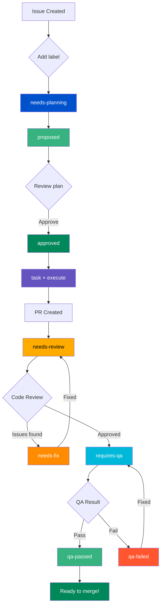

# Setting Up repo-sapiens with a New Gitea Repository

A complete, step-by-step tutorial for configuring repo-sapiens automation on a fresh Gitea repository.

---

## Prerequisites

Before you begin, ensure you have:

- [ ] Access to a Gitea instance with **Actions enabled**
- [ ] A Gitea account with permission to create repositories
- [ ] Python 3.11 or higher installed locally
- [ ] Git installed and configured
- [ ] An Anthropic Claude API key (get one at https://console.anthropic.com/)

---

## Part 1: Create Your Gitea Repository

### Step 1.1: Create the Repository

1. Navigate to your Gitea instance (e.g., `https://gitea.example.com`)
2. Click the **+** button → **New Repository**
3. Fill in the details:
   - **Owner**: Your username or organization
   - **Repository Name**: e.g., `my-project`
   - **Visibility**: Private or Public (your choice)
   - **Initialize repository**: Check this box
   - **Default Branch**: `main`
4. Click **Create Repository**

### Step 1.2: Clone the Repository Locally

```bash
# Clone your new repository
git clone https://gitea.example.com/your-username/my-project.git
cd my-project
```

### Step 1.3: Create a Gitea API Token

1. In Gitea, click your profile picture → **Settings**
2. Go to **Applications** → **Manage Access Tokens**
3. Click **Generate New Token**
4. Configure the token:
   - **Token Name**: `repo-sapiens-automation`
   - **Scopes**: Select at minimum:
     - `repo` (Full control of repositories)
     - `issue` (Read/write issues)
     - `notification` (optional, for notifications)
5. Click **Generate Token**
6. **Copy and save the token immediately** - you won't see it again!

---

## Part 2: Install and Initialize repo-sapiens

### Step 2.1: Install repo-sapiens

```bash
# Option A: Install from PyPI (recommended)
pip install repo-sapiens

# Option B: Install from source (for development)
git clone https://github.com/savorywatt/repo-sapiens.git
cd repo-sapiens
pip install -e .
```

Verify the installation:

```bash
automation --help
```

### Step 2.2: Initialize in Your Repository

Navigate to your cloned repository and run the interactive setup:

```bash
cd /path/to/my-project
repo-sapiens init
```

The init wizard will:

1. **Auto-detect** your Git remote configuration
2. **Prompt** for your Gitea API token
3. **Ask** whether to use Claude API or local Claude Code
4. **Store** credentials securely
5. **Generate** `automation/config/automation_config.yaml`

Example session:

```
🚀 Initializing repo-sapiens

🔍 Discovering repository configuration...
   ✓ Found Git repository: /home/user/my-project
   ✓ Detected remote: origin
   ✓ Parsed: owner=your-username, repo=my-project
   ✓ Base URL: https://gitea.example.com

🔑 Setting up credentials...

Gitea API Token is required. Get it from:
   https://gitea.example.com/user/settings/applications

Enter your Gitea API token: ●●●●●●●●●●●●

Do you want to use Claude API or local Claude Code? [api/local]: api

Enter your Claude API key: ●●●●●●●●●●●●

📦 Storing credentials in keyring backend...
   ✓ Stored: gitea/api_token
   ✓ Stored: claude/api_key
   ✓ Credentials stored securely

📝 Creating configuration file...
   ✓ Created: automation/config/automation_config.yaml

✅ Initialization complete!
```

---

## Part 3: Set Up Gitea Repository Secrets

The Gitea Actions workflows need access to your credentials. These must be configured as repository secrets.

### Step 3.1: Navigate to Repository Secrets

1. Go to your repository in Gitea
2. Click **Settings** (gear icon)
3. Click **Actions** → **Secrets**

### Step 3.2: Add Required Secrets

Add the following secrets:

| Secret Name | Value | Description |
|-------------|-------|-------------|
| `BUILDER_GITEA_TOKEN` | Your Gitea API token | Used to interact with issues, PRs, and labels |
| `BUILDER_GITEA_URL` | `https://gitea.example.com` | Your Gitea instance URL |
| `BUILDER_CLAUDE_API_KEY` | Your Claude API key | Used for AI-powered automation |

To add each secret:
1. Click **Add Secret**
2. Enter the **Name** (exactly as shown above)
3. Enter the **Value**
4. Click **Add Secret**

### Step 3.3: Verify Secrets Are Configured

You should see all three secrets listed (values are hidden):

```
BUILDER_GITEA_TOKEN     *****
BUILDER_GITEA_URL       *****
BUILDER_CLAUDE_API_KEY  *****
```

---

## Part 4: Copy Workflow Files

The automation is driven by Gitea Actions workflows. You need to copy these to your repository.

### Step 4.1: Create the Workflows Directory

```bash
mkdir -p .gitea/workflows
```

### Step 4.2: Copy the Core Workflow Files

You can either copy from the repo-sapiens source or create them manually.

**Option A: Copy from repo-sapiens installation**

If you cloned repo-sapiens:

```bash
# From your project directory
cp -r /path/to/repo-sapiens/.gitea/workflows/*.yaml .gitea/workflows/
```

**Option B: Create minimal workflow set**

At minimum, you need `needs-planning.yaml` to get started. Create this file:

```bash
cat > .gitea/workflows/needs-planning.yaml << 'EOF'
name: Needs Planning

on:
  issues:
    types: [labeled]

jobs:
  create-plan:
    name: Create Development Plan
    if: gitea.event.label.name == 'needs-planning'
    runs-on: ubuntu-latest
    timeout-minutes: 30

    steps:
      - name: Checkout code
        uses: actions/checkout@v4
        with:
          token: ${{ secrets.BUILDER_GITEA_TOKEN }}

      - name: Set up Python
        uses: actions/setup-python@v5
        with:
          python-version: '3.11'

      - name: Install repo-sapiens
        run: |
          pip install --upgrade pip
          pip install repo-sapiens

      - name: Create plan proposal
        env:
          AUTOMATION__GIT_PROVIDER__BASE_URL: ${{ secrets.BUILDER_GITEA_URL }}
          AUTOMATION__GIT_PROVIDER__API_TOKEN: ${{ secrets.BUILDER_GITEA_TOKEN }}
          AUTOMATION__REPOSITORY__OWNER: ${{ gitea.repository_owner }}
          AUTOMATION__REPOSITORY__NAME: ${{ gitea.event.repository.name }}
          AUTOMATION__AGENT_PROVIDER__API_KEY: ${{ secrets.BUILDER_CLAUDE_API_KEY }}
        run: |
          echo "🔍 Processing issue #${{ gitea.event.issue.number }} for planning"
          automation process-issue --issue ${{ gitea.event.issue.number }}

      - name: Comment on success
        if: success()
        uses: actions/github-script@v7
        with:
          github-token: ${{ secrets.BUILDER_GITEA_TOKEN }}
          script: |
            github.rest.issues.createComment({
              issue_number: context.issue.number,
              owner: context.repo.owner,
              repo: context.repo.repo,
              body: '✅ **Plan proposal created!**\n\nReview the plan and add the `approved` label to proceed.\n\n🤖 Posted by repo-sapiens'
            })
EOF
```

### Step 4.3: Full Workflow Set (Recommended)

For the complete automation pipeline, copy these workflow files:

| Workflow File | Purpose |
|---------------|---------|
| `needs-planning.yaml` | Generates development plans from issues |
| `approved.yaml` | Creates task issues from approved plans |
| `execute-task.yaml` | Implements tasks using AI |
| `needs-review.yaml` | Runs AI code review |
| `needs-fix.yaml` | Creates fix proposals from review feedback |
| `requires-qa.yaml` | Runs build and tests |
| `build-artifacts.yaml` | Pre-builds the automation wheel |
| `automation-daemon.yaml` | Scheduled polling for pending work |
| `monitor.yaml` | Health monitoring |

### Step 4.4: Commit and Push Workflows

```bash
git add .gitea/workflows/
git commit -m "Add repo-sapiens automation workflows"
git push origin main
```

---

## Part 5: Create Required Labels

The automation uses labels to track workflow state. Create these in Gitea.

### Step 5.1: Navigate to Labels

1. Go to your repository
2. Click **Issues** → **Labels**
3. Click **New Label** for each label below

### Step 5.2: Create the Labels

Create these labels (colors are suggestions):

| Label Name | Color | Description |
|------------|-------|-------------|
| `needs-planning` | `#0052CC` (blue) | Issue needs a development plan |
| `proposed` | `#36B37E` (green) | Plan has been proposed |
| `approved` | `#00875A` (dark green) | Plan approved, ready for tasks |
| `task` | `#6554C0` (purple) | This is a task issue |
| `execute` | `#FF5630` (red) | Task ready to execute |
| `needs-review` | `#FFAB00` (yellow) | PR needs code review |
| `needs-fix` | `#FF8B00` (orange) | Changes needed based on review |
| `requires-qa` | `#00B8D9` (cyan) | Ready for QA/testing |
| `qa-passed` | `#36B37E` (green) | QA passed |
| `qa-failed` | `#FF5630` (red) | QA failed |
| `completed` | `#6B778C` (gray) | Work completed |

**Quick creation via API** (optional):

```bash
# Set your variables
GITEA_URL="https://gitea.example.com"
GITEA_TOKEN="your-token"
OWNER="your-username"
REPO="my-project"

# Create labels
for label in "needs-planning:#0052CC" "proposed:#36B37E" "approved:#00875A" \
             "task:#6554C0" "execute:#FF5630" "needs-review:#FFAB00" \
             "needs-fix:#FF8B00" "requires-qa:#00B8D9" "qa-passed:#36B37E" \
             "qa-failed:#FF5630" "completed:#6B778C"; do
  name="${label%%:*}"
  color="${label##*:}"
  curl -X POST "$GITEA_URL/api/v1/repos/$OWNER/$REPO/labels" \
    -H "Authorization: token $GITEA_TOKEN" \
    -H "Content-Type: application/json" \
    -d "{\"name\": \"$name\", \"color\": \"${color#\#}\"}"
done
```

---

## Part 6: Verify Gitea Actions Is Enabled

### Step 6.1: Check Repository Settings

1. Go to your repository → **Settings**
2. Look for **Actions** in the sidebar
3. Ensure **Enable Repository Actions** is checked

### Step 6.2: Verify Runner Availability

1. Go to **Settings** → **Actions** → **Runners**
2. You should see at least one runner listed and **Online**

If no runners are available, you'll need to:
- Use Gitea's built-in runner (if configured)
- Set up a self-hosted runner
- Contact your Gitea administrator

---

## Part 7: Test Your Setup

### Step 7.1: Create a Test Issue

1. Go to your repository → **Issues** → **New Issue**
2. Create an issue:
   - **Title**: `Add a hello world function`
   - **Body**:
     ```
     Create a simple Python function that prints "Hello, World!"

     Requirements:
     - Create a file called `hello.py`
     - Add a function `greet()` that prints the greeting
     - Include a docstring
     ```

### Step 7.2: Trigger the Automation

1. On the issue page, click **Labels**
2. Add the `needs-planning` label
3. Watch the magic happen!

### Step 7.3: Monitor Progress

**Via Gitea UI:**
1. Go to **Actions** tab
2. You should see the "Needs Planning" workflow running
3. Click on it to view logs

**Via CLI:**
```bash
# Check workflow status
automation --config automation/config/automation_config.yaml list-plans

# View specific plan
automation --config automation/config/automation_config.yaml show-plan --plan-id 1
```

### Step 7.4: Expected Flow

1. **Workflow triggers** when `needs-planning` label is added
2. **Plan is generated** by Claude AI
3. **Comment is posted** on the issue with the plan
4. **`proposed` label** is added automatically
5. **You review** the plan
6. **Add `approved` label** to proceed
7. **Task issues are created** automatically
8. **Tasks execute** and create PRs
9. **Code review** runs automatically
10. **QA** runs on passing reviews
11. **PRs ready for merge** when QA passes

---

## Part 8: Configuration Reference

### Configuration File Location

After running `repo-sapiens init`, your config is at:

```
my-project/
└── automation/
    └── config/
        └── automation_config.yaml
```

### Key Configuration Options

```yaml
# automation/config/automation_config.yaml

git_provider:
  provider_type: gitea
  base_url: https://gitea.example.com
  api_token: "@keyring:gitea/api_token"  # Secure reference

repository:
  owner: your-username
  name: my-project
  default_branch: main

agent_provider:
  provider_type: claude-api
  model: claude-sonnet-4.5  # or claude-opus-4.5 for complex tasks
  api_key: "@keyring:claude/api_key"

workflow:
  plans_directory: plans
  state_directory: .automation/state
  branching_strategy: per-agent
  max_concurrent_tasks: 3

tags:
  needs_planning: needs-planning
  plan_review: plan-review
  ready_to_implement: ready-to-implement
```

### Environment Variable Overrides

For CI/CD, override config values with environment variables:

```bash
AUTOMATION__GIT_PROVIDER__BASE_URL=https://gitea.example.com
AUTOMATION__GIT_PROVIDER__API_TOKEN=your-token
AUTOMATION__REPOSITORY__OWNER=your-username
AUTOMATION__REPOSITORY__NAME=my-project
AUTOMATION__AGENT_PROVIDER__API_KEY=your-claude-key
```

---

## Part 9: Troubleshooting

### Workflow Doesn't Trigger

**Symptoms:** Adding a label doesn't start any workflow.

**Checklist:**
1. Is Gitea Actions enabled for your repository?
2. Is there an available runner?
3. Do the workflow files exist in `.gitea/workflows/`?
4. Did you push the workflow files to the `main` branch?
5. Is the label name exactly correct (case-sensitive)?

**Debug:**
```bash
# Verify workflows are present
ls -la .gitea/workflows/

# Check if Actions sees your workflows
# (In Gitea UI: Actions tab should list your workflows)
```

### Authentication Errors

**Symptoms:** `401 Unauthorized` or `403 Forbidden` errors in workflow logs.

**Checklist:**
1. Are the secrets configured in repository settings?
2. Are the secret names correct? (`BUILDER_GITEA_TOKEN`, etc.)
3. Is the API token still valid (not expired)?
4. Does the token have sufficient permissions?

**Debug:**
```bash
# Test token locally
curl -H "Authorization: token YOUR_TOKEN" \
  "https://gitea.example.com/api/v1/user"
```

### Plan Generation Fails

**Symptoms:** Workflow runs but fails at "Create plan proposal" step.

**Checklist:**
1. Is `BUILDER_CLAUDE_API_KEY` configured?
2. Is your Claude API key valid and has credits?
3. Check the workflow logs for specific error messages

**Debug:**
```bash
# Test Claude API locally
automation --config automation/config/automation_config.yaml \
  process-issue --issue 1 --log-level DEBUG
```

### "No module named 'automation'" Error

**Symptoms:** Workflow fails with import error.

**Solution:** The workflow should install repo-sapiens. Check the install step:

```yaml
- name: Install repo-sapiens
  run: |
    pip install --upgrade pip
    pip install repo-sapiens
```

### Workflow Runs But Nothing Happens

**Symptoms:** Workflow shows success but no plan is created.

**Checklist:**
1. Check the workflow condition: `if: gitea.event.label.name == 'needs-planning'`
2. Verify the label was actually added (not just edited)
3. Look at the full workflow logs for any skipped steps

---

## Part 10: Next Steps

### Enable Full Automation Pipeline

Copy all workflow files for the complete automation experience:

```bash
# From repo-sapiens source
cp /path/to/repo-sapiens/.gitea/workflows/*.yaml .gitea/workflows/
git add .gitea/workflows/
git commit -m "Add complete automation workflow set"
git push
```

### Set Up Scheduled Daemon

The `automation-daemon.yaml` workflow polls for pending work every 5 minutes. Enable it by:

1. Copying the file to `.gitea/workflows/`
2. Adjusting the cron schedule if needed
3. Pushing to your repository

### Monitor and Manage

```bash
# List all active plans
automation list-plans

# Check system health
automation health-check

# Process manually
automation process-all

# View specific plan status
automation show-plan --plan-id 1
```

### Customize Workflow Behavior

- Edit workflow timeout values
- Adjust cron schedules
- Modify label names (update both workflows and config)
- Add custom workflow stages

---

## Quick Reference

### CLI Commands

```bash
# Initialize in a new repo
repo-sapiens init

# Process single issue
automation process-issue --issue 42

# Process all pending issues
automation process-all

# List active plans
automation list-plans

# Show plan details
automation show-plan --plan-id 42

# Run health check
automation health-check

# Run as daemon
automation daemon --interval 60
```

### Required Gitea Secrets

| Secret | Purpose |
|--------|---------|
| `BUILDER_GITEA_TOKEN` | Gitea API access |
| `BUILDER_GITEA_URL` | Gitea instance URL |
| `BUILDER_CLAUDE_API_KEY` | Claude AI API access |

### Label Flow



---

## Support

- **Documentation**: See the `docs/` directory for detailed guides
- **Issues**: https://github.com/savorywatt/repo-sapiens/issues
- **Workflow Reference**: `.gitea/workflows/label-routing-guide.md`

Happy automating!
