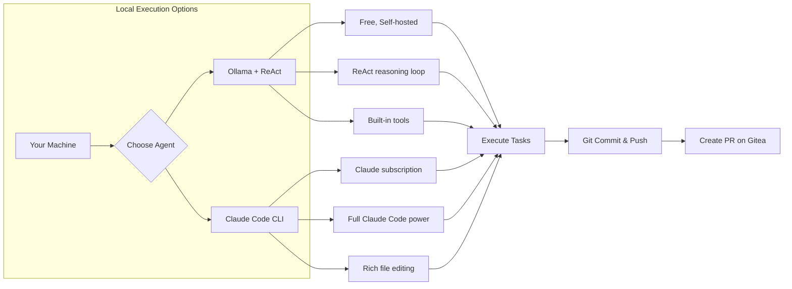
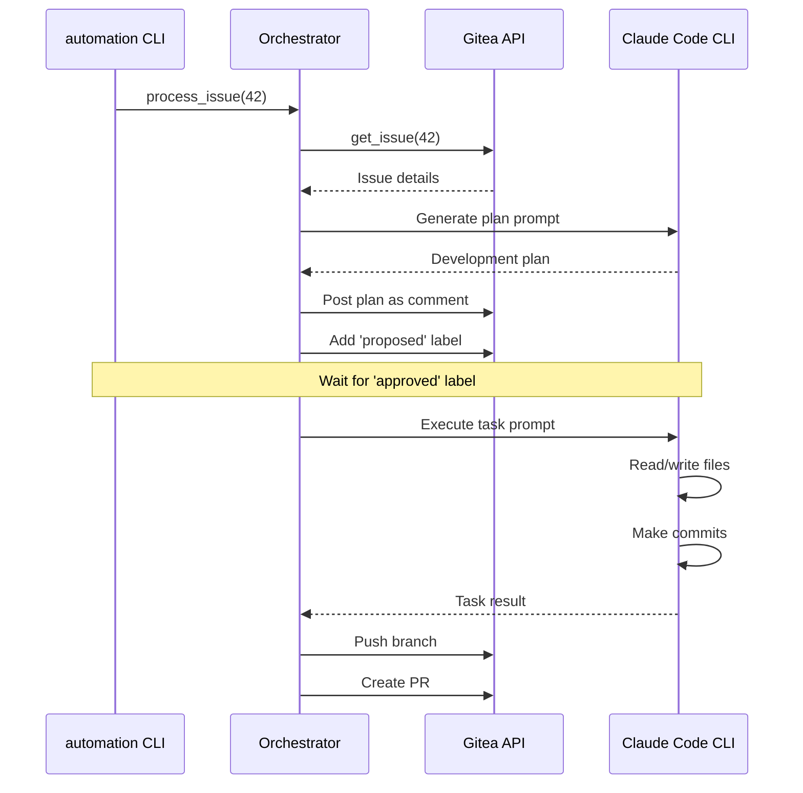

# Local Execution Workflow

Run repo-sapiens automation locally using either **Ollama with the ReAct agent** or **Claude Code CLI**. This guide covers interactive development workflows where your local AI agent picks up tasks, executes them, and pushes changes.

---

## Overview

repo-sapiens supports two local execution modes:



| Feature | Ollama + ReAct | Claude Code CLI |
|---------|----------------|-----------------|
| Cost | Free | Claude subscription |
| Reasoning | ReAct loop (Thought → Action → Observation) | Full Claude capabilities |
| Tools | Built-in (read, write, edit, shell, search) | Claude Code's full toolset |
| Speed | Depends on hardware | Fast (cloud) |
| Privacy | 100% local | Data sent to Anthropic |
| Best for | Development, testing, cost-sensitive | Production quality, complex tasks |

---

## Part 1: Ollama + ReAct Agent

The ReAct agent uses Ollama for reasoning and includes built-in tools for file operations.

### 1.1 Install and Configure Ollama

```bash
# Install Ollama
curl -fsSL https://ollama.ai/install.sh | sh

# Start Ollama server
ollama serve

# Pull recommended models (in another terminal)
ollama pull codellama:13b      # Best for code tasks
ollama pull llama3.1:8b        # Good general purpose, faster
ollama pull deepseek-coder:6.7b # Efficient code model

# Verify
ollama list
```

### 1.2 Interactive REPL Mode

The easiest way to use the ReAct agent is through the interactive REPL:

```bash
# Start interactive mode
automation react --repl

# With specific model
automation react --repl --model codellama:13b

# With custom working directory
automation react --repl --working-dir /path/to/project
```

**REPL Commands:**

| Command | Description |
|---------|-------------|
| `/help` | Show available commands |
| `/models` | List available Ollama models |
| `/model <name>` | Switch to a different model |
| `/pwd` | Show current working directory |
| `/verbose` | Toggle verbose mode (show reasoning steps) |
| `/clear` | Clear screen |
| `/quit` | Exit REPL |

**Example REPL Session:**

```
$ automation react --repl --model codellama:13b

============================================================
ReAct Agent REPL
============================================================
Model: codellama:13b
Ollama: http://localhost:11434
Working directory: /home/user/my-project
Available models: codellama:13b, llama3.1:8b, deepseek-coder:6.7b

Commands:
  Type a task to execute it
  /help          - Show this help
  /models        - List available models
  /model <name>  - Switch to a different model
  /pwd           - Show working directory
  /verbose       - Toggle verbose mode
  /clear         - Clear screen
  /quit          - Exit REPL
============================================================

react> Create a Python function that calculates fibonacci numbers

[Task #1] Create a Python function that calculates fibonacci numbers

Starting ReAct agent with model: codellama:13b

--- Result ---
Status: SUCCESS

Answer:
Created fibonacci.py with the following function:
- fib(n): Returns the nth fibonacci number using memoization
- Added docstring and type hints
- Included example usage

Files changed: fibonacci.py

react> Add unit tests for the fibonacci function

[Task #2] Add unit tests for the fibonacci function

--- Result ---
Status: SUCCESS

Answer:
Created test_fibonacci.py with pytest tests:
- test_base_cases: Tests fib(0)=0, fib(1)=1
- test_known_values: Tests fib(10)=55, fib(20)=6765
- test_negative: Tests error handling for negative input

Files changed: test_fibonacci.py

react> /quit
Goodbye!
```

### 1.3 Single Task Execution

Run a single task from the command line:

```bash
# Execute a single task
automation react "Create a hello.py file that prints Hello World"

# With verbose output (shows reasoning steps)
automation react "Refactor the utils.py module" --verbose

# With custom settings
automation react "Add error handling to api.py" \
  --model codellama:13b \
  --max-iterations 15 \
  --working-dir /path/to/project
```

### 1.4 Available ReAct Tools

The ReAct agent has access to these tools:

| Tool | Description | Parameters |
|------|-------------|------------|
| `read_file` | Read file contents | `path` |
| `write_file` | Create or overwrite a file | `path`, `content` |
| `edit_file` | Replace specific text in a file | `path`, `old_text`, `new_text` |
| `list_directory` | List directory contents | `path` |
| `find_files` | Find files by glob pattern | `pattern`, `path` |
| `search_files` | Search file contents (like grep) | `pattern`, `path`, `file_pattern` |
| `run_command` | Execute shell command | `command` |
| `tree` | Display directory structure | `path`, `max_depth` |
| `finish` | Mark task complete | `answer`, `summary` |

**Example: How ReAct Reasons**

When you ask "Find all Python files that import requests", the agent thinks:

```
THOUGHT: I need to find Python files that import requests. I'll use search_files
         to search for 'import requests' in .py files.
ACTION: search_files
ACTION_INPUT: {"pattern": "import requests", "file_pattern": "*.py"}

OBSERVATION:
api/client.py:3:import requests
utils/http.py:1:import requests
tests/test_api.py:5:import requests

THOUGHT: I found 3 files that import requests. I'll provide this as the answer.
ACTION: finish
ACTION_INPUT: {"answer": "Found 3 Python files that import requests:\n- api/client.py (line 3)\n- utils/http.py (line 1)\n- tests/test_api.py (line 5)"}
```

### 1.5 Processing Gitea Issues with Ollama

Configure repo-sapiens to use Ollama for issue processing:

```yaml
# automation/config/automation_config.yaml
git_provider:
  provider_type: gitea
  base_url: http://localhost:3000
  api_token: ${BUILDER_GITEA_TOKEN}

repository:
  owner: your-username
  name: your-repo
  default_branch: main

agent_provider:
  provider_type: ollama
  model: codellama:13b
  base_url: http://localhost:11434
  local_mode: true

workflow:
  plans_directory: plans
  state_directory: .automation/state
  max_concurrent_tasks: 1
```

Then process issues:

```bash
# Process a single issue
automation process-issue --issue 42

# Process all issues with a specific label
automation process-all --tag needs-planning

# Run as daemon (polls for new issues)
automation daemon --interval 60
```

---

## Part 2: Claude Code CLI

Use the full power of Claude Code for local task execution.

### 2.1 Install Claude Code

```bash
# Install Claude Code CLI
npm install -g @anthropic-ai/claude-code

# Verify installation
claude --version

# Authenticate (opens browser)
claude auth
```

### 2.2 Configure for Claude Local

```yaml
# automation/config/automation_config.yaml
git_provider:
  provider_type: gitea
  base_url: http://localhost:3000
  api_token: ${BUILDER_GITEA_TOKEN}

repository:
  owner: your-username
  name: your-repo
  default_branch: main

agent_provider:
  provider_type: claude-local
  model: claude-sonnet-4.5
  local_mode: true
  # No API key needed - uses Claude Code authentication

workflow:
  plans_directory: plans
  state_directory: .automation/state
  max_concurrent_tasks: 1
```

### 2.3 Process Issues with Claude Code

```bash
# Process a single issue - Claude Code will execute the task
automation process-issue --issue 42

# Process entire plan
automation process-plan --plan-id 42

# Run daemon mode
automation daemon --interval 60
```

### 2.4 How Claude Code Execution Works

When you run `automation process-issue --issue 42`:



The orchestrator:
1. Fetches the issue from Gitea
2. Sends a planning prompt to Claude Code
3. Claude Code analyzes and creates a plan
4. Posts the plan as a comment
5. Waits for approval (or processes immediately in auto mode)
6. Executes each task via Claude Code
7. Claude Code modifies files and commits
8. Pushes the branch and creates a PR

---

## Part 3: CLI Command Reference

### Core Commands

```bash
# Initialize repo-sapiens in a new project
repo-sapiens init

# Process a single issue
automation process-issue --issue <number>

# Process all issues (optionally filtered by tag)
automation process-all [--tag <label>]

# Process a specific plan
automation process-plan --plan-id <id>

# Run in daemon mode (continuous polling)
automation daemon --interval <seconds>

# List active plans
automation list-plans

# Show plan details
automation show-plan --plan-id <id>
```

### ReAct Agent Commands

```bash
# Single task execution
automation react "<task description>"

# Interactive REPL
automation react --repl

# With options
automation react "<task>" \
  --model <ollama-model> \
  --ollama-url <url> \
  --max-iterations <n> \
  --working-dir <path> \
  --verbose
```

### Common Options

| Option | Description | Default |
|--------|-------------|---------|
| `--config` | Path to config file | `automation/config/automation_config.yaml` |
| `--log-level` | Logging verbosity | `INFO` |

---

## Part 4: Workflow Examples

### Example 1: Local Development with Ollama

**Scenario**: You want to implement a feature locally using free AI.

```bash
# 1. Start Ollama
ollama serve &

# 2. Start REPL in your project
cd /path/to/my-project
automation react --repl --model codellama:13b

# 3. Interactively develop
react> What's the structure of this project?
react> Create a new API endpoint for user profiles
react> Add validation for the email field
react> Write tests for the new endpoint
react> /quit

# 4. Review and commit changes
git status
git diff
git add -A
git commit -m "Add user profile API endpoint"
```

### Example 2: Process Gitea Issues Locally

**Scenario**: Process issues from Gitea using your local Claude Code.

```bash
# 1. Configure for claude-local
cat > automation/config/local_config.yaml << 'EOF'
git_provider:
  provider_type: gitea
  base_url: http://localhost:3000
  api_token: ${BUILDER_GITEA_TOKEN}

repository:
  owner: myorg
  name: myproject
  default_branch: main

agent_provider:
  provider_type: claude-local
  model: claude-sonnet-4.5
  local_mode: true
EOF

# 2. Set credentials
export BUILDER_GITEA_TOKEN="your-gitea-token"

# 3. Process an issue
automation --config automation/config/local_config.yaml process-issue --issue 15

# Claude Code will:
# - Read the issue
# - Generate a plan
# - Execute tasks
# - Commit changes
# - Push to a branch
# - Create a PR
```

### Example 3: Daemon Mode for Continuous Processing

**Scenario**: Run locally and continuously process new issues.

```bash
# Start daemon with Ollama backend
automation --config automation/config/ollama_config.yaml daemon --interval 120

# The daemon will:
# - Poll Gitea every 2 minutes
# - Find issues with 'needs-planning' label
# - Process them using Ollama
# - Create branches and PRs
```

### Example 4: Quick Code Tasks with ReAct

```bash
# Create a file
automation react "Create a Python script that downloads images from URLs"

# Refactor existing code
automation react "Refactor database.py to use async/await"

# Add documentation
automation react "Add docstrings to all functions in utils/"

# Debug help
automation react "Find why the tests in test_api.py are failing"

# Code review
automation react "Review main.py and suggest improvements"
```

---

## Part 5: Configuration Reference

### Ollama Configuration

```yaml
agent_provider:
  provider_type: ollama
  model: codellama:13b           # Model name
  base_url: http://localhost:11434  # Ollama server URL
  local_mode: true
```

### Claude Local Configuration

```yaml
agent_provider:
  provider_type: claude-local
  model: claude-sonnet-4.5       # Claude model
  local_mode: true
  # No API key - uses Claude Code auth
```

### Environment Variables

```bash
# Gitea credentials
export BUILDER_GITEA_URL="http://localhost:3000"
export BUILDER_GITEA_TOKEN="your-token"

# Ollama settings
export OLLAMA_BASE_URL="http://localhost:11434"
export OLLAMA_MODEL="codellama:13b"

# Override config values
export AUTOMATION__AGENT_PROVIDER__MODEL="llama3.1:8b"
export AUTOMATION__WORKFLOW__MAX_CONCURRENT_TASKS="2"
```

---

## Part 6: Tips and Best Practices

### For Ollama + ReAct

1. **Choose the right model**:
   - `codellama:7b` - Fast, good for simple tasks
   - `codellama:13b` - Best balance for code tasks
   - `llama3.1:8b` - Good general purpose
   - `deepseek-coder:6.7b` - Efficient code model

2. **Use verbose mode when debugging**:
   ```bash
   automation react "task" --verbose
   ```

3. **Adjust max iterations for complex tasks**:
   ```bash
   automation react "complex refactoring task" --max-iterations 20
   ```

4. **Keep tasks focused** - Break large tasks into smaller ones.

### For Claude Code

1. **Ensure authentication**:
   ```bash
   claude auth status
   ```

2. **Use appropriate model**:
   - `claude-sonnet-4.5` - Fast, good for most tasks
   - `claude-opus-4.5` - Best quality for complex tasks

3. **Interactive Q&A** - Claude Code can ask questions via issue comments when it needs clarification.

### General Tips

1. **Start with REPL** - Use interactive mode to experiment before automating.

2. **Review before push** - Always review AI-generated changes:
   ```bash
   git diff
   git log --oneline -5
   ```

3. **Use daemon mode carefully** - Start with long intervals and monitor results.

4. **Keep config in version control** - But use environment variables for secrets.

---

## Troubleshooting

### Ollama Issues

**"Ollama not running"**
```bash
# Start Ollama
ollama serve

# Check if running
curl http://localhost:11434/api/tags
```

**"Model not found"**
```bash
# List available models
ollama list

# Pull missing model
ollama pull codellama:13b
```

**Slow performance**
- Use a smaller model: `codellama:7b` instead of `codellama:34b`
- Ensure sufficient RAM
- Check GPU acceleration is working: `nvidia-smi`

### Claude Code Issues

**"Claude CLI not found"**
```bash
# Install Claude Code
npm install -g @anthropic-ai/claude-code

# Verify
claude --version
```

**"Authentication required"**
```bash
# Re-authenticate
claude auth
```

### General Issues

**"Configuration file not found"**
```bash
# Specify config path
automation --config /path/to/config.yaml process-issue --issue 1
```

**"Permission denied"**
```bash
# Check Gitea token has correct scopes
# Token needs: repo, write:issue, write:pull_request
```

---

## Quick Reference

### Start Ollama REPL
```bash
ollama serve &
automation react --repl --model codellama:13b
```

### Process Issue with Claude Code
```bash
automation --config automation/config/claude_config.yaml process-issue --issue 42
```

### Run Daemon with Ollama
```bash
automation --config automation/config/ollama_config.yaml daemon --interval 120
```

### Execute Single Task
```bash
automation react "Create a README.md for this project" --verbose
```
